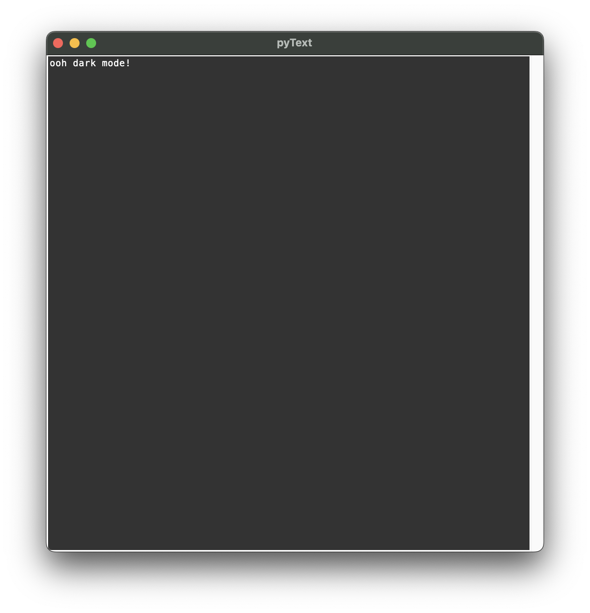

# pyText

A simple text editor with Python!

## The mission of pyText:

We want to make a **light-weight** text editor made with **Python**, a simple to use/install programming language which was perfect for implementing features, customization and bug fixes! So **you** can build your own themes, fix bugs **yourself** and submit them in GitHub, **and so on!** This project is **open-source** so you can easily view the whole code without downloading a single file!

## Features:

- Font changes
- Font size changes (for the editor only)
- Closing safety, so you don't press Control + W on accident and lose everything
- Dark mode

### Upcoming features:

#### Higher priority

- pyText documentation Links inside pyText
- Creation of local copies of pyText documentation inside pyText

#### Lower priority

- **Bold**, *Italic* and <u>Underline</u> text
- Highlights (with custom colours!)