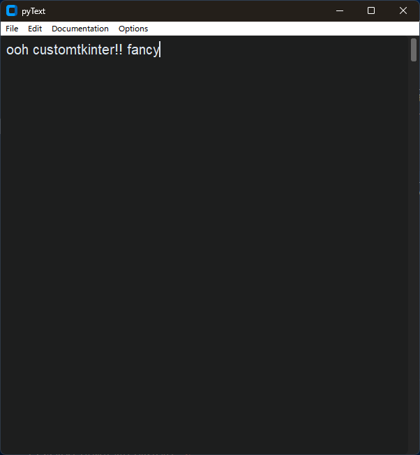

# pyText

A simple text editor for Python!

## The mission of pyText:

We want to make a **light-weight** text editor made with **Python**, a simple to use/install programming language which was perfect for implementing features, customization and bug fixes! So **you** can build your own themes, fix bugs **yourself** and submit them in GitHub, **and so on!** This project is **open-source** so you can easily view the whole code without downloading a single file! Since people like convenince, for **macOS exclusively\***, there is an .app file you can install to run pyText as simply as hitting the icon twice!

## Keybinds:

Windows/Linux

<!-- Table -->
| Key | Function |
|------|------|
| Ctrl + N | New file |
| Ctrl + O | Open file |
| Ctrl + S | Save file |
| Alt + S | Save as file |
| Ctrl + D | Discard file |
| Ctrl + C | Copy selected text |
| Ctrl + X | Copy selected text and remove it |
| Ctrl + V | Pastes copied text |
| Ctrl + A | Select all text in document |
| Ctrl + / | Open pyText settings |
| Ctrl + W | Close pyText |

macOS

<!-- Table -->
| Key | Function |
|------|------|
| Cmd + N | New file |
| Cmd + O | Open file |
| Cmd + S | Save file |
| Opt + S | Save as file |
| Cmd + D | Discard file |
| Cmd + C | Copy selected text |
| Cmd + X | Copy selected text and remove it |
| Cmd + V | Pastes copied text |
| Cmd + A | Select all text in document |
| Cmd + / | Open pyText settings |
| Cmd + W | Close pyText |

